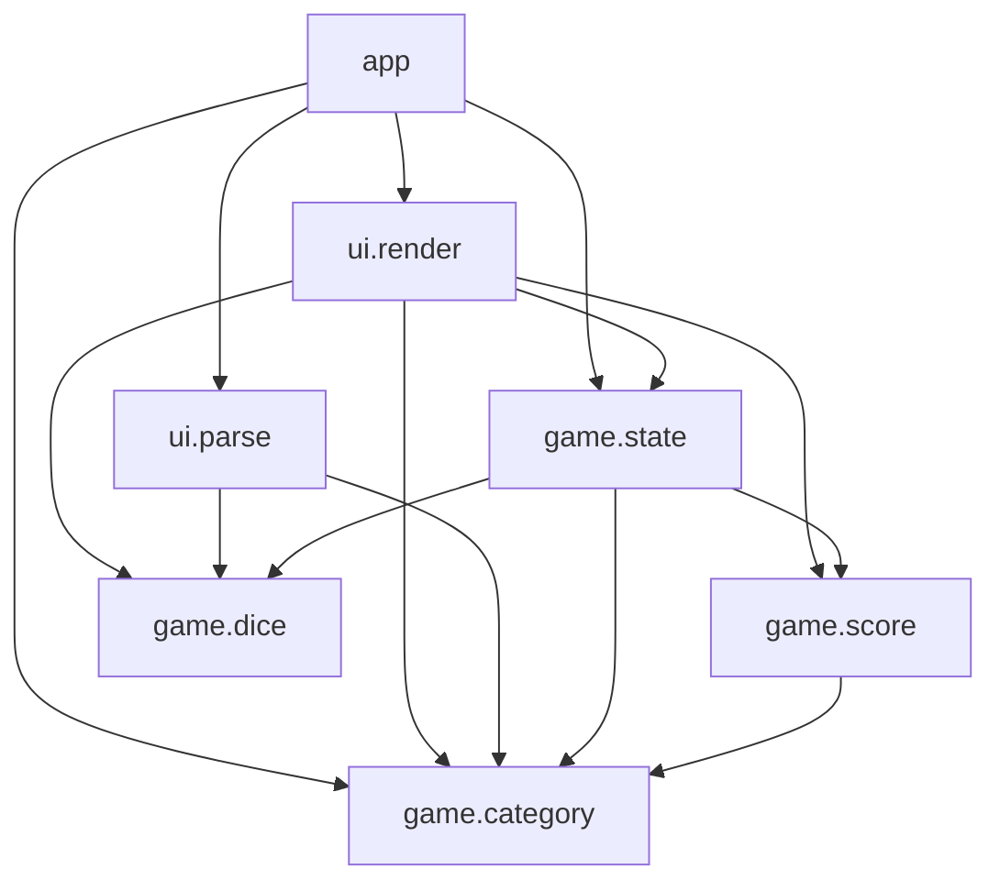
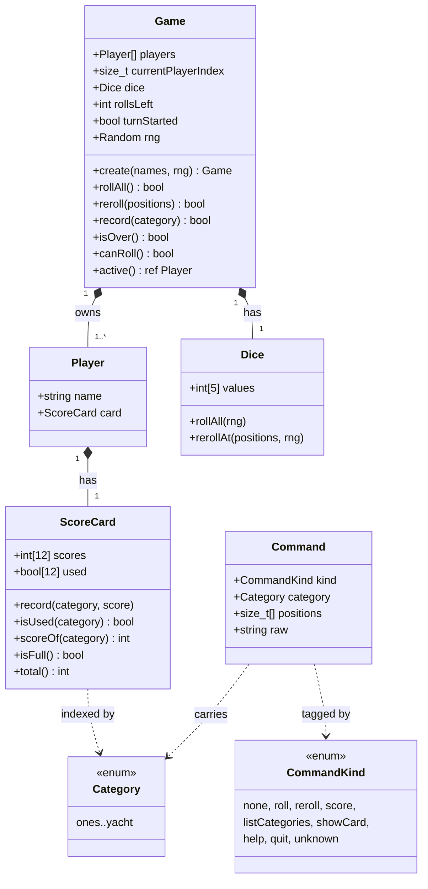
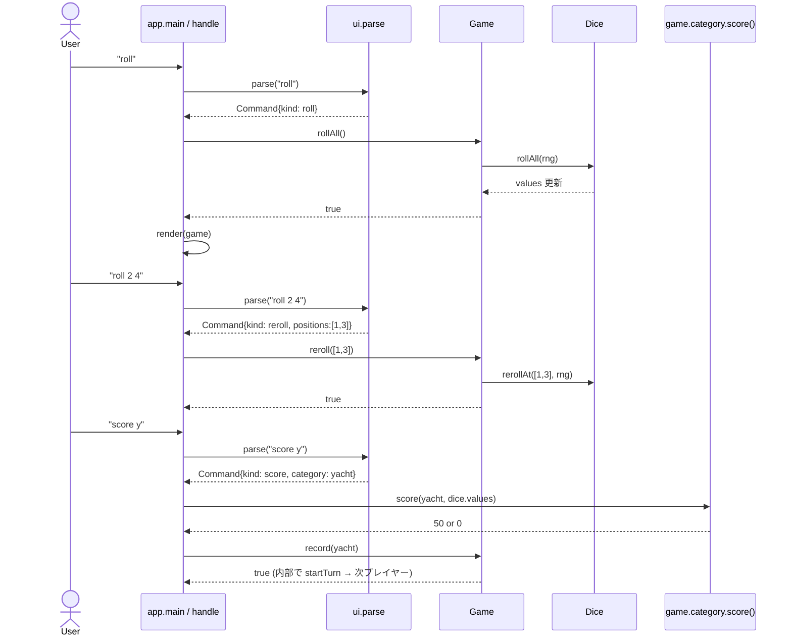
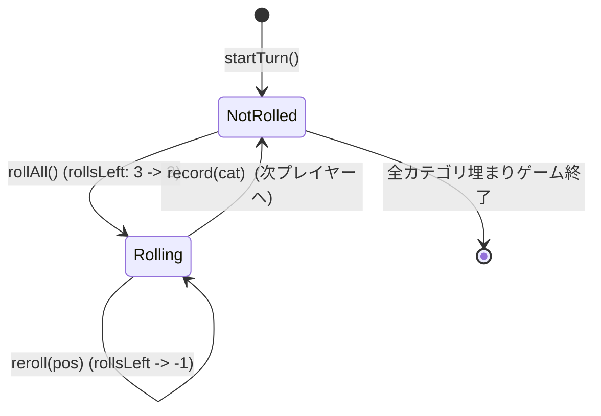

# アーキテクチャ

実装全体の見取り図。`source/` 以下のモジュール関係と、ターン進行の流れをまとめる。
コードを読み始める前にここを眺めると、各ファイルの責務がつかみやすい。

## レイヤー

3 層に分けて考える。**下から上に依存** する (上位は下位を import するが逆はしない)。

| レイヤー | モジュール                                     | 役割                                       |
| -------- | ---------------------------------------------- | ------------------------------------------ |
| App      | `app`                                          | 起動・REPL ループ・コマンドのディスパッチ  |
| UI       | `ui.parse`, `ui.render`                        | 入力文字列の解釈、画面への描画             |
| Domain   | `game.state`, `game.dice`, `game.score`, `game.category` | ルール・状態・点数計算 (純粋ロジック)      |

Domain は **標準入出力にも乱数源 (固有値) にも直接触れない**
(乱数は `Random` を引数で受け取る形にして、テストでシード固定できるようにする)。

## モジュール依存

ポイント:

- Domain 内部での依存は `state -> {dice, category, score}` と `score -> category` のみ。循環なし。
- UI レイヤーは Domain を読むだけで Domain を変更しない (`render` は `in Game`)。
- `app` だけが Domain を **書き換える側** (REPL ループから `Game.rollAll/reroll/record` を呼ぶ)。

## クラス図 (主要型)

D に「クラス」は無いが (Yacht の範囲では `class` を使わない)、構造体間の関係を UML 風に。

凡例:
- `*--` (filled diamond) = 構成 (composition、所有)。
- `..>` (dashed arrow) = 依存 (型として参照)。

## ターン 1 回分の流れ (シーケンス)

「最初の roll → 振り直し → 記録」までを 1 つの手番として。

要点:

- **入力 → 解釈 → 状態更新 → 描画** が 1 サイクル。
- 解釈 (`Parse`) は文字列を `Command` に変換するだけで状態を持たない (純粋関数)。
- 状態更新 (`Game.*`) は失敗を `bool` で返す。例外は使わない。
- 点数計算 (`game.category.score`) は `pure @safe` で副作用ゼロ → unittest だけで検証できる。

## 状態遷移

`Game` のターン中の状態:

- `turnStarted == false` のときに使えるのは `rollAll` のみ。
- `turnStarted == true` のときは `reroll` と `record` が有効。
- `rollsLeft == 0` でも、まだ `record` は呼べる (= スコア確定はできる)。

## ファイル一覧 (実装)

| ファイル                          | 主な内容                                                       |
| --------------------------------- | -------------------------------------------------------------- |
| `source/app.d`                    | `main`, `handle`, REPL ループ。**ロジックは持たない**          |
| `source/game/dice.d`              | `Dice` 構造体、`rollOne`/`rollAll`/`rerollAt`                  |
| `source/game/category.d`          | `Category` enum、`score()`、`tryParseCategory()`               |
| `source/game/score.d`             | `ScoreCard` 構造体 (12 スロット)                               |
| `source/game/state.d`             | `Game`/`Player` 構造体、ターン進行                              |
| `source/ui/parse.d`               | `Command`/`CommandKind`、入力文字列を `Command` に変換          |
| `source/ui/render.d`              | スコアカード・ダイス・ヘルプの描画                              |

## 設計上の選び方 (なぜそうしたか)

- **`class` ではなく `struct`** : 値型で十分。所有関係も明確で、GC を意識する必要が薄い。
- **コマンドを enum + 構造体に変換** : `dispatch` 内で文字列分岐すると肥大化する。`Command` を一度作ってから処理することで、テスト可能なパース層が独立する。
- **スコア計算を純粋関数に閉じる** : ダイス配列 → 点数の写像。状態にも乱数にも依存しないので、unittest が安定する。
- **Random は Game の中** : テスト時は `Random(固定シード)` で `Game.create` できる。グローバル `__gshared` を避けた理由はこれ。
- **失敗は戻り値、例外を投げない** : ユーザー入力は不正なのが当たり前。例外で巻き戻すよりも、`bool`/`out` で「失敗したのでメッセージ出して続行」が REPL に向く。

## どこを最初に読むか

学習目的なら次の順がおすすめ:

1. `game/dice.d` (10 行未満。型と乱数の使い方)
2. `game/category.d` (純粋関数 + unittest がそろっている。役判定の基礎)
3. `game/score.d` (固定長配列のラッパー)
4. `game/state.d` (上 3 つを使う集約)
5. `ui/parse.d` (文字列 → Command。tryParse パターン)
6. `ui/render.d` (出力整形)
7. `app.d` (上を全部つなぐ薄い層)
