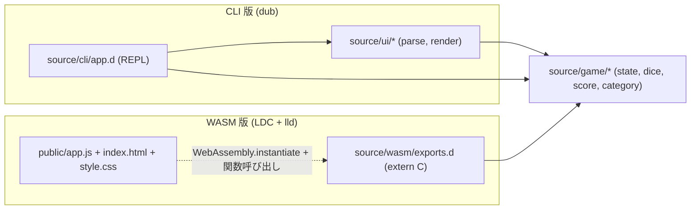
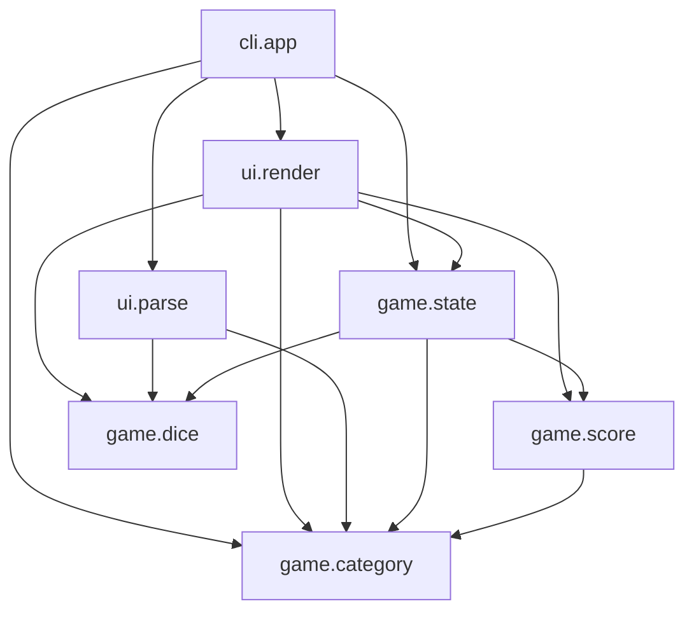
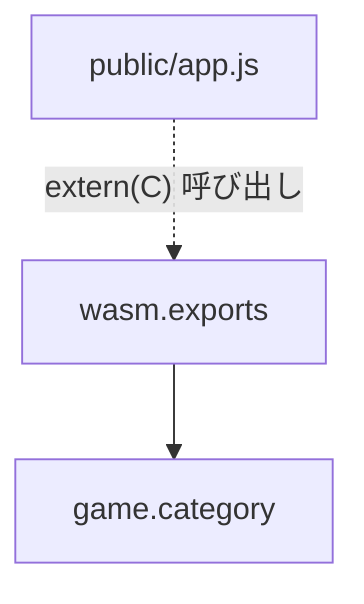
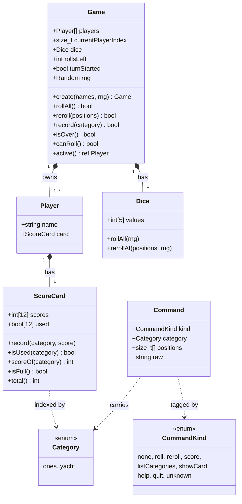
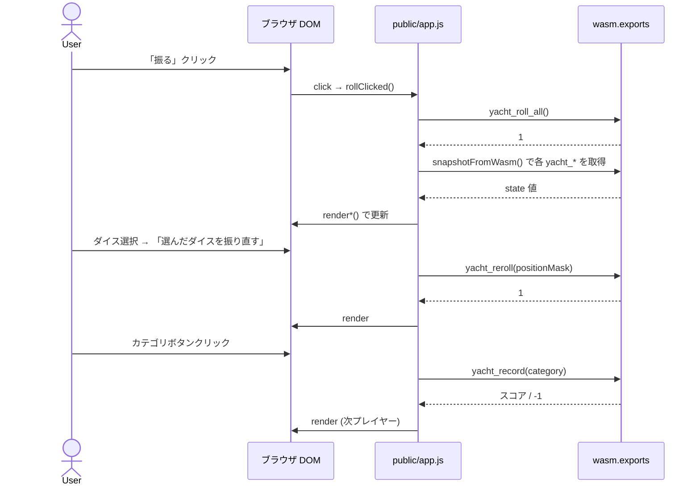
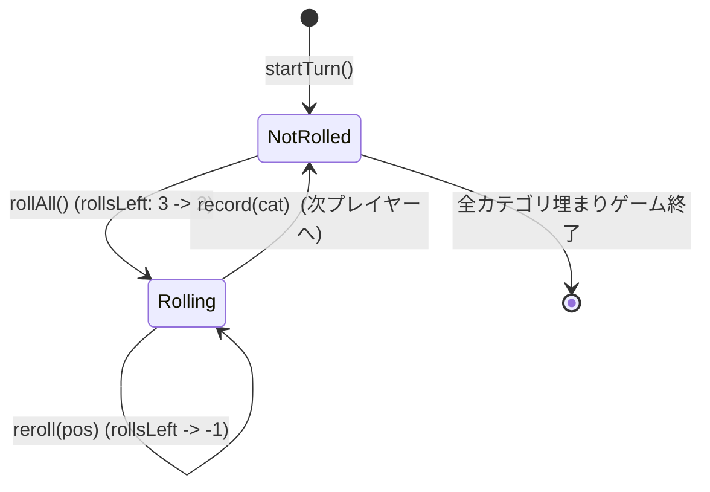

# アーキテクチャ

実装全体の見取り図。`source/` のモジュール関係と `public/` のフロントエンド、
ターン進行の流れをまとめる。コードを読み始める前にここを眺めると、
各ファイルの責務がつかみやすい。

## 2 つの入口

main ブランチには 2 つのビルド対象がある。**ドメイン (`game.*`) は両方が共有** する。

役割分担:

- **CLI 版**: `source/cli/app.d` が REPL ループを回し、`source/ui/*` が
  入力パース・標準出力描画を担う。`game.state.Game` を中心とした完全な状態を持つ。
- **WASM 版**: `source/wasm/exports.d` が `extern(C)` の関数を公開。
  `Game` は再利用せず、固定長配列で `WasmGame` を構築している (betterC 制約のため)。
  描画と入力ループは JS 側 (`public/app.js`) にある。

## レイヤー (CLI 側)

3 層で考える。**下から上に依存** する (上位は下位を import するが逆はしない)。

| レイヤー | モジュール                                               | 役割                                            |
| -------- | -------------------------------------------------------- | ----------------------------------------------- |
| App      | `cli.app`                                                | 起動・REPL ループ・コマンドのディスパッチ       |
| UI       | `ui.parse`, `ui.render`                                  | 入力文字列の解釈、画面への描画                  |
| Domain   | `game.state`, `game.dice`, `game.score`, `game.category` | ルール・状態・点数計算 (純粋ロジック)           |

Domain は **標準入出力にも乱数源にも直接触れない**
(乱数は `Random` を引数で受け取る形にして、テストでシード固定できるようにする)。

## モジュール依存 (CLI)

ポイント:

- Domain 内部での依存は `state -> {dice, category, score}` と `score -> category` のみ。循環なし。
- UI レイヤーは Domain を読むだけで Domain を変更しない (`render` は `in Game`)。
- `cli.app` だけが Domain を **書き換える側** (REPL ループから `Game.rollAll/reroll/record` を呼ぶ)。

## モジュール依存 (WASM)

WASM ビルドが取り込むのは `source/wasm/exports.d` と `source/game/category.d` の 2 ファイルだけ。
`game.category` は文字列処理部分を `version (D_BetterC) {} else { ... }` で外している。
詳しい制約は `docs/wasm.md` 参照。

## クラス図 (主要型)

CLI 側で使われる主要型。WASM 側は同等の役割を `WasmGame` `Scorecard` 構造体で
平らに表現している (固定長配列のみ)。

凡例:
- `*--` (filled diamond) = 構成 (composition、所有)。
- `..>` (dashed arrow) = 依存 (型として参照)。

## ターン 1 回分の流れ (CLI)

「最初の roll → 振り直し → 記録」までを 1 つの手番として。

## ターン 1 回分の流れ (WASM 版)

JS 側がブラウザイベントを起点に WASM を駆動する。

要点:

- **入力 → 解釈 → 状態更新 → 描画** は CLI と同じ 1 サイクル。
- WASM 側はリニアメモリにグローバル `g` を持ち、JS は値を都度 `yacht_*` 経由で取り出す。
- `snapshotFromWasm()` が REST 版 (`server` ブランチ) と互換の形に整形しているので、
  `render*()` は CLI 出力と JS DOM の両方で再利用できる思想。

## 状態遷移

`Game` (CLI) / `WasmGame` (WASM) の手番中の状態。

- `turnStarted == false` のときに使えるのは `rollAll` のみ。
- `turnStarted == true` のときは `reroll` と `record` が有効。
- `rollsLeft == 0` でも、まだ `record` は呼べる (= スコア確定はできる)。

## ファイル一覧 (実装)

| ファイル                  | 主な内容                                                       |
| ------------------------- | -------------------------------------------------------------- |
| `source/cli/app.d`        | `main`, `handle`, REPL ループ。**ロジックは持たない**          |
| `source/wasm/exports.d`   | `extern(C)` 関数群、`WasmGame` 構造体、xorshift32 PRNG          |
| `source/game/dice.d`      | `Dice` 構造体、`rollOne`/`rollAll`/`rerollAt`                  |
| `source/game/category.d`  | `Category` enum、`score()`、`tryParseCategory()`               |
| `source/game/score.d`     | `ScoreCard` 構造体 (12 スロット)                               |
| `source/game/state.d`     | `Game`/`Player` 構造体、ターン進行 (CLI 専用)                  |
| `source/ui/parse.d`       | `Command`/`CommandKind`、入力文字列を `Command` に変換          |
| `source/ui/render.d`      | スコアカード・ダイス・ヘルプの描画                              |
| `public/index.html`       | DOM レイアウト (setup / game / scoreboard / modal)              |
| `public/app.js`           | WASM ロード + i18n + render + 簡易 CPU AI                       |
| `public/style.css`        | 配色・レイアウト                                                |

## 設計上の選び方 (なぜそうしたか)

- **`class` ではなく `struct`** : 値型で十分。所有関係も明確で、GC を意識する必要が薄い。
- **コマンドを enum + 構造体に変換** : `dispatch` 内で文字列分岐すると肥大化する。`Command` を一度作ってから処理することで、テスト可能なパース層が独立する。
- **スコア計算を純粋関数に閉じる** : ダイス配列 → 点数の写像。状態にも乱数にも依存しないので、unittest が安定する。WASM ビルドにも持っていける。
- **Random は Game の中** : テスト時は `Random(固定シード)` で `Game.create` できる。グローバル `__gshared` を避けた理由はこれ (WASM 側は betterC 都合で `__gshared` の `WasmGame` を採用、ここだけ例外)。
- **失敗は戻り値、例外を投げない** : ユーザー入力は不正なのが当たり前。例外で巻き戻すよりも、`bool`/`out` で「失敗したのでメッセージ出して続行」が REPL にも JS 連携にも向く。
- **WASM では `game.state` を再利用しない** : 動的配列 / `string` / `Random` を含むため betterC 不可。
  代わりに `wasm.exports` で固定長配列の `WasmGame` を新設、ロジックは小さく書き直す。

## どこを最初に読むか

学習目的なら次の順がおすすめ:

1. `game/dice.d` (10 行台。型と乱数の使い方)
2. `game/category.d` (純粋関数 + unittest がそろっている。役判定の基礎)
3. `game/score.d` (固定長配列のラッパー)
4. `game/state.d` (上 3 つを使う集約)
5. `ui/parse.d` (文字列 → Command。tryParse パターン)
6. `ui/render.d` (出力整形)
7. `cli/app.d` (上を全部つなぐ薄い層)
8. `wasm/exports.d` (1〜3 を betterC で書き直した版)
9. `public/app.js` (WASM ローダ + UI + i18n + CPU AI)
