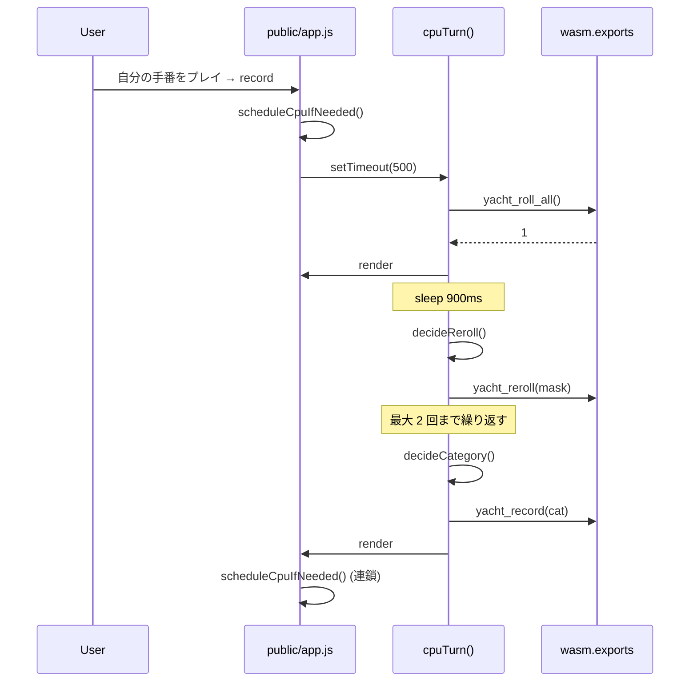

# CPU プレイヤー

ゲーム本体は WASM (D 製) のままで、AI ロジックは **JS 側** (`public/app.js`) に持つ。
WASM 再ビルドなしで戦略を差し替えられるのと、決定論的な再現を要求しない用途なので、
分離の旨みが大きい。

## セットアップ UI

`renderNameFields()` が各プレイヤー行に「CPU」チェックボックスを生やす。
チェック有無は `state.isCpu[i]` (boolean 配列) に保存。
名前フィールドが空の場合のデフォルトは CPU なら `CPU<n>`、人間なら `P<n>`。

## 進行制御

- `recordScore()` と `startNewGame()` の末尾で `scheduleCpuIfNeeded()` を呼ぶ。
- `scheduleCpuIfNeeded()` は現在プレイヤーが CPU かつ実行中で無ければ
  `setTimeout(cpuTurn, 500)` で起動。
- `cpuTurn()` は `cpuRunning` フラグで再入を防ぎつつ、
  `roll_all → reroll(最大2回) → record` を `await sleep(900)` 挟みで進める。
- 各ステップ前に `aborted()` で「ゲーム終了 / 中断 / プレイヤー人間化」を確認し、
  該当すれば即座に抜ける (リスタート時の競合対策)。

## 戦略 (簡易ヒューリスティック)

`decideReroll()`:

- **5 個揃い** (yacht): 振り直さない
- **3 個揃い + ペア** (full house): 振り直さない
- **1-5 / 2-6 ストレート完成**: 振り直さない
- **4 個揃い**: 余りの 1 個だけ振り直す (5 個目を狙う)
- **3 個揃い**: 残り 2 個を振り直す (4 個揃い or full house を狙う)
- **2 個揃い**: ペア以外を振り直す (3 個目を狙う)
- **すべてバラバラ**: 全部振り直す

`decideCategory()`:

- preview の **正のスコアが最大** のカテゴリを選ぶ
- 全 0 点しかない場合: **達成困難な役から捨てる**
  (`yacht → big-straight → little-straight → four-of-a-kind → full-house → ones..sixes → choice` の順)

## UI 上の挙動

- CPU 手番中、振るボタンは disabled で「CPU 思考中...」と表示
- カテゴリ確定ボタンは描画しない (`renderCategories` で `state.isCpu[currentPlayer]` を見て早期 return)
- ダイスは普通にアニメのように更新される (各 step で `render()` を呼ぶため)
- 全員 CPU でも自動進行 (cpuTurn 末尾の scheduleCpuIfNeeded で連鎖)

## 既知の弱点 / 改善案

ストレート系を能動的に狙う動きはしないので強い AI ではない。改善するなら:

1. **カテゴリ目標を先に決める**: 残り未使用カテゴリと現在の出目を見て
   「狙うべき役」を 1 つ決め、それに合致するダイスだけを keep する
2. **期待値計算**: 残り振り回数 × 出目分布から各カテゴリの期待スコアを計算、選ぶ
3. **上ボーナス意識**: 1〜6 の役 (CLI/WASM 共通の Yacht ルールにはボーナスなしだが、
   将来 Yahtzee 風に上の段ボーナスを追加するなら考慮)
4. **難易度設定**: ランダムに「悪手」を混ぜることで弱モード、上記期待値計算で強モード

## ファイル

- `public/app.js` の `cpuTurn` / `decideReroll` / `decideCategory` / `scheduleCpuIfNeeded`
- WASM 側 (`source/wasm/exports.d`) は **CPU 機能のための変更なし** (公開 API だけ叩いている)
