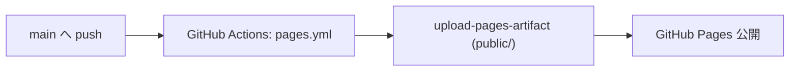

# GitHub Pages デプロイ

`main` への push で、`public/` 直下を GitHub Pages に自動デプロイする。
公開先: <https://kip2.github.io/Yacht/>

## 仕組み



ワークフロー: `.github/workflows/pages.yml`

```yaml
name: Deploy to Pages
on:
  push:
    branches: [main]
  workflow_dispatch:
permissions:
  contents: read
  pages: write
  id-token: write
concurrency:
  group: "pages"
  cancel-in-progress: true
jobs:
  build:
    runs-on: ubuntu-latest
    steps:
      - uses: actions/checkout@v4
      - uses: actions/configure-pages@v5
      - uses: actions/upload-pages-artifact@v3
        with:
          path: public
  deploy:
    needs: build
    environment:
      name: github-pages
      url: ${{ steps.deployment.outputs.page_url }}
    runs-on: ubuntu-latest
    steps:
      - id: deployment
        uses: actions/deploy-pages@v4
```

## ビルド時の Action は走らせない

`public/yacht.wasm` を **リポジトリにコミット済** なので、CI 内で LDC を入れて
ビルドする必要がない。Pages workflow は `public/` をそのままアップロードするだけ。

→ 利点: workflow が高速 (~30 秒)、依存トラブルが少ない
→ 欠点: D ソースを変えたときに `scripts/build-wasm.sh` を **手元で実行して
コミットし忘れる** と Pages に反映されない。push 前に `scripts/build-wasm.sh`
を必ず走らせる運用 (将来的に CI でリビルドさせる選択肢もあり、`docs/testing.md` 参照)。

## 初回設定で踏んだ落とし穴

1. **絶対パスで CSS / JS を参照していた**
   - `<link href="/style.css">` のような絶対パス記述は、
     Pages が `https://kip2.github.io/Yacht/` という **サブパス配信** だと 404 になる
     (`/style.css` は `https://kip2.github.io/style.css` を見にいくため)。
   - 対策: HTML 内のリンクはすべて **相対パス** にする (`<link href="style.css">`)。
2. **Pages 有効化方法**
   - 初回は `gh api -X POST /repos/<owner>/<repo>/pages -f build_type=workflow` で
     Actions 駆動の Pages を作成。GUI でも Settings → Pages → Source: GitHub Actions に切替で同等。

## 動作確認の手順

push 後に Pages が更新されたか確認:

```sh
# 最新 workflow の状況
gh run list --branch main --limit 3

# 完了するまで待つ
gh run watch

# デプロイ先の HTML / wasm が 200 を返すか
curl -s -o /dev/null -w "%{http_code}\n" https://kip2.github.io/Yacht/
curl -s -o /dev/null -w "%{http_code} %{content_type}\n" https://kip2.github.io/Yacht/yacht.wasm
```

ブラウザでは `Ctrl+Shift+R` で強制リロードしないと CDN キャッシュが効いて古いファイルを見ることがある。

## トラブルシュート

| 症状                          | 原因 / 対処                                                |
| ----------------------------- | ---------------------------------------------------------- |
| Pages にアクセスして 404      | Pages 設定が無効 or workflow 未デプロイ。`gh run list` で確認 |
| HTML は表示されるが装飾なし   | 絶対パスを使っていないか確認 (上記 1 と同じ)               |
| ボタンを押しても何も起きない | `app.js` の読み込みが 404。同上の絶対パス問題か命名ミス     |
| WASM が読めない (Content-Type) | Pages では `.wasm` は自動的に `application/wasm` で配信される |
| 反映されない                  | 強制リロード、または Pages workflow が成功しているか確認    |

## ローカルで Pages 同等を再現する

```sh
scripts/build-wasm.sh           # 必要な人だけ
scripts/serve.sh                # → http://127.0.0.1:8765/
```

詳しい手順は `docs/README.md` 参照。
