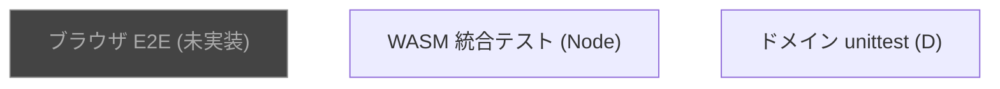

# テスト

3 層に分けてテストを置く方針。**重い E2E ではなく、各層で独立に小さく回す**。



## レイヤー A: ドメイン (`game.*`) の unittest

D の `unittest` ブロックがソース内に同居していて、`dub test` で走る。
役判定 (`game.category.score`)・スコアカード (`game.score.ScoreCard`)・
ターン進行 (`game.state.Game`) などを純粋関数として検証。

```sh
dub test
# → 5 modules passed unittests
```

書く場所: 各 `.d` ファイル末尾の `unittest { ... }` ブロック。
詳細は `docs/coding-style.md` の unittest 節。

## レイヤー B: WASM 統合テスト (Node)

`public/yacht.wasm` を Node から `WebAssembly.instantiate` でロードし、
`extern(C)` 関数を直接叩いて状態変化を assert する。
**ブラウザを起動せずに WASM のロジック層を網羅できる** のが旨味。

```sh
scripts/build-wasm.sh        # 必要に応じて先にビルド
node --test tests/wasm/       # 全テスト実行
```

実装: `tests/wasm/test.mjs` に `node --test` 形式で並べる。標準ライブラリ完結 (依存ゼロ)。

カバー範囲の例:
- `yacht_new` 後の初期状態
- `yacht_roll_all` → ダイスが 1-6 の範囲で 5 個出る
- `yacht_reroll` の bitmask が正しく解釈される
- `yacht_record` のあとプレイヤーが進む
- `yacht_preview` が `score` ロジックと整合
- `yacht_is_over` が全カテゴリ埋まったときだけ 1

## レイヤー C: ブラウザ E2E (未実装)

DOM 操作を含む完全な動作確認。**いまは手動テスト** (`docs/README.md` のブラウザ手順)。
将来的に **Playwright** を採用する想定 (D には適切なツールがないため、Node のテスト rig)。
導入するときは `tests/e2e/` に置き、`docker compose up` した WASM サイトに対して走らせる。

## CI

GitHub Actions: `.github/workflows/test.yml`

- A (`dub test`): Ubuntu ランナーに DMD を入れて毎 push で実行
- B (Node WASM テスト): LDC + lld で wasm をビルドしてから `node --test` で実行
- C は未実装

Pages デプロイ workflow (`.github/workflows/pages.yml`) とは独立。
test workflow が落ちても Pages デプロイは止まらない (現状) が、
将来的に Pages デプロイの依存にしてもよい。

## 手動の確認手順

ローカルで一通り遊んで挙動を見る場合:

```sh
scripts/build-wasm.sh
scripts/serve.sh
# → http://127.0.0.1:8765/ をブラウザで開いて動かす
```

確認ポイント:
- 1 人 / 2 人 / CPU 含めた組合せで 1 ゲーム回せるか
- 言語切替 (右上 EN ボタン) で全文言が変わるか
- 役名ホバーでツールチップが出るか
- 「遊び方」モーダルが ESC / 背景クリックで閉じるか
- ゲーム終了画面で勝者が正しいか

詳しいブラウザ手順は `docs/README.md`、Pages 公開先での確認は `docs/deploy.md`。
