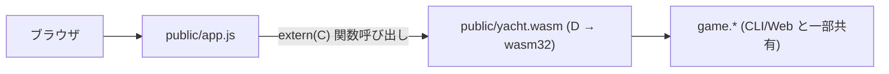

# WebAssembly 版

サーバ無しで GitHub Pages から遊べる構成。
D で書いたゲームロジックを WASM にコンパイルし、ブラウザだけで動かす。

## ビルド

```sh
scripts/build-wasm.sh         # → public/yacht.wasm (約 8 KB)
```

スクリプトの中身は LDC を直接呼ぶだけ:

```sh
ldc2 -mtriple=wasm32-unknown-unknown-wasm \
  -betterC -Os -release --boundscheck=off \
  source/wasm/exports.d source/game/category.d \
  -L=--no-entry -L=--export-dynamic \
  -of=public/yacht.wasm
```

LDC + wasm-ld (lld の一部) が必要。Arch なら `sudo pacman -S ldc lld`。

## ローカルで遊ぶ

任意の静的サーバで `public/` を配信:

```sh
cd public && python3 -m http.server 8765
# → http://127.0.0.1:8765/
```

(Python の `http.server` は `.wasm` を `application/wasm` で返してくれる。
それ以外のサーバを使う場合、`fetch` → `arrayBuffer` → `WebAssembly.instantiate`
の経路で読んでいるので Content-Type は気にしなくていい。)

## 全体方針



- 既存の `web.api` (REST) と `web.session` は **使わない**。
- フロントは `fetch` でなく `WebAssembly.instantiateStreaming` で `.wasm` をロードし、
  `extern(C)` でエクスポートされた関数を直接呼ぶ。
- ゲーム状態は **WASM のリニアメモリ内** にグローバル変数で持つ。
  プレイヤー名は WASM では持たず、JS 側で配列管理する。

## ツールチェーン

- **コンパイラ**: [LDC](https://github.com/ldc-developers/ldc) (`ldc2`)。
  dmd は WebAssembly ターゲットを持たないので必須。Arch なら `sudo pacman -S ldc`。
- **ターゲット**: `wasm32-unknown-unknown-wasm`
- **モード**: `-betterC` (GC・例外・druntime を使わない)
  - 利用可能: `struct`、固定長配列 `int[N]`、`enum`、`extern(C)`、基本的なテンプレート、
    モジュールレベルの定数、`pure`/`@safe`
  - 不可: `class`、動的配列 `int[]` の `~=`、`string` への代入操作、連想配列、
    例外、GC アロケーション、TLS、unittest 実行 (コンパイルは可)
- **JS 連携**: `WebAssembly.Memory`、`WebAssembly.Module`、`instantiateStreaming`

## ビルド (LDC 導入後)

dub の追加 configuration `wasm` で:

```sh
dub build -c wasm --compiler=ldc2
# → public/yacht.wasm が出力される想定
```

直接 ldc2 を叩く案 (`scripts/build-wasm.sh`) は柔軟性が高いが、
まずは dub config で完結させる方向で試す。失敗したら shell script に切り替える。

## ディレクトリ計画

```text
Yacht/
├── source/
│   ├── wasm/
│   │   └── exports.d     # extern(C) で公開する関数群、PRNG、状態
│   ├── game/             # 一部を共有 (詳細下記)
│   ├── cli/              # 触らない (server ブランチでも動く)
│   ├── web/              # 触らない (server ブランチで動く)
│   └── ui/               # 触らない
├── public/
│   ├── index.html        # WASM 用 UI に書き換え予定
│   ├── app.js            # fetch → wasm exports に書き換え予定
│   ├── style.css         # ほぼ流用
│   └── yacht.wasm        # ← ビルド成果物 (gitignore)
└── docs/wasm.md          # このファイル
```

## ドメインの再利用

| モジュール          | WASM での扱い                                          |
| ------------------- | ------------------------------------------------------ |
| `game.category`     | `Category` enum と `score()` を再利用したい。          |
|                     | `categoryNames`/`categoryAliases`/`tryParseCategory` は |
|                     | string を扱うので WASM 側では使わない。                 |
| `game.dice`         | `Dice` 構造体 (`int[5]`) は再利用可能だが、            |
|                     | `std.random` 依存があるので `rollAll`/`rollOne` は     |
|                     | WASM では使わない。dice は exports.d 内で直接 `int[5]` を持つ。 |
| `game.score`        | `ScoreCard` (固定長配列) は再利用候補。                 |
| `game.state`        | **再利用しない**。`Player[]` 動的配列 / `string` /     |
|                     | `Random` を含むため。代わりに `WasmGame` を新設。        |
| `ui.*`、`web.*`     | WASM では完全に不使用。                                 |

`game.category` の `immutable string[] categoryNames = [...]` が betterC で問題に
なる可能性あり。だめなら category.d を「scoreロジック」と「文字列名」で分離する。

## 公開する API (案)

すべて `extern (C)` で関数のみ (戻り値は `int`、ポインタは使わない)。
複雑な構造はリニアメモリ越しでなく **getter で 1 値ずつ取り出す**。

```d
// 初期化
void yacht_new(int playerCount, uint seed);

// アクション (成功 1 / 失敗 0)
int yacht_roll_all();
int yacht_reroll(int positionMask);  // ビット 0..4 が ダイス 0..4 の振り直しフラグ
int yacht_record(int category);      // 成功時は確定した点数を返す。失敗時 -1
int yacht_preview(int category);     // 振っているダイスでの仮スコア。-1 = 不正

// 状態取得
int yacht_player_count();
int yacht_current_player();
int yacht_rolls_left();
int yacht_turn_started();   // 0 / 1
int yacht_is_over();        // 0 / 1
int yacht_die_value(int idx);                        // -1 で範囲外
int yacht_score_value(int player, int category);     // 0 含む整数 / 未確定でも 0
int yacht_score_used(int player, int category);      // 0 / 1
int yacht_player_total(int player);
```

PRNG は betterC 内で xorshift32 を実装。`std.random` には触らない。

## JS 側のラッパー (案)

```js
const wasmModule = await WebAssembly.instantiateStreaming(fetch("/yacht.wasm"), {});
const w = wasmModule.instance.exports;

const Yacht = {
  newGame(playerCount, names) {
    this.names = names;
    w.yacht_new(playerCount, (Math.random() * 2**32) >>> 0);
  },
  rollAll()         { return !!w.yacht_roll_all(); },
  reroll(positions) {
    const mask = positions.reduce((m, p) => m | (1 << p), 0);
    return !!w.yacht_reroll(mask);
  },
  record(catIdx)    { return w.yacht_record(catIdx); },
  preview(catIdx)   { return w.yacht_preview(catIdx); },
  state() {
    const playerCount = w.yacht_player_count();
    const players = [];
    for (let p = 0; p < playerCount; p++) {
      const scores = {};
      let total = 0;
      for (let c = 0; c < CATEGORY_KEYS.length; c++) {
        if (w.yacht_score_used(p, c)) {
          const v = w.yacht_score_value(p, c);
          scores[CATEGORY_KEYS[c]] = v;
          total += v;
        } else {
          scores[CATEGORY_KEYS[c]] = null;
        }
      }
      players.push({ name: this.names[p], scores, total });
    }
    const dice = Array.from({length: 5}, (_, i) => w.yacht_die_value(i));
    return {
      currentPlayer: w.yacht_current_player(),
      rollsLeft: w.yacht_rolls_left(),
      turnStarted: !!w.yacht_turn_started(),
      isOver: !!w.yacht_is_over(),
      dice,
      players,
      preview: this._buildPreview(playerCount),
      // winner は isOver なら JS 側で集計
    };
  },
  // ...
};
```

`Yacht.state()` が今までの REST レスポンスと同じ形を返せれば、
`public/app.js` の `render*` 系はほぼそのまま使える。

## ステップの記録 (実装済)

1. **LDC + lld 導入** ✓
2. `source/wasm/exports.d` に状態・PRNG・extern(C) エクスポートを実装 ✓
3. `source/game/category.d` の `categoryNames` / `tryParseCategory` を
   `version (D_BetterC) {} else { ... }` で WASM ビルドから外し、
   `score()` と `Category` enum だけを共有 ✓
4. `scripts/build-wasm.sh` でビルド (dub config は使わなかった。
   wasm 出力名・リンクフラグは shell の方が素直だったため) ✓
5. `public/app.js` を WASM 駆動に書き換え (REST 版は `server` ブランチに保存) ✓

## 既知の制約 / 注意

- ゲーム状態は WASM のリニアメモリ内 (`__gshared WasmGame g`) に持つ。
  ページリロードで失われる (= 中断したゲームは復帰できない)。
  必要になったら JS 側で snapshot を `localStorage` に保存して再現する仕掛けを足す。
- ビルドは **`-release --boundscheck=off`** が必須。
  デバッグビルドだと配列添字チェックの `__assert` が引き、リンクできない。
- `game.category` から **string を扱う関数を WASM ビルドに含めると memcmp 未解決** で死ぬ。
  分離は `version (D_BetterC)` だけで十分。
- `--export-dynamic` で全 D 関数を export しているが、
  wasm のサイズは ~8KB なので問題視していない。気になるなら個別 `--export=yacht_*` に切り替える。

## CPU プレイヤー (`cpu` ブランチ)

ゲーム本体は WASM (D 製) のままで、AI ロジックは **JS 側** に持つ。
WASM 再ビルドなしで戦略を差し替えられるのと、決定論的な再現をしないからこの分割が楽。

### セットアップ UI

`renderNameFields()` が各プレイヤー行に「CPU」チェックボックスを生やす。
チェック有無は `state.isCpu[i]` (boolean 配列) に保存。
名前フィールドが空の場合のデフォルトは CPU なら `CPU<n>`、人間なら `P<n>`。

### 進行制御

- `recordScore()` と `startNewGame()` の末尾で `scheduleCpuIfNeeded()` を呼ぶ。
- `scheduleCpuIfNeeded()` は現在プレイヤーが CPU かつ実行中で無ければ `setTimeout(cpuTurn, 500)`。
- `cpuTurn()` は `cpuRunning` フラグで再入を防ぎつつ、
  `roll_all → reroll(最大2回) → record` を `await sleep(900)` 挟みで進める。
- 各ステップ前に `aborted()` で「ゲーム終了/中断/プレイヤー人間化」を確認し、
  該当すれば即座に抜ける (リスタート時の競合対策)。

### 戦略 (簡易ヒューリスティック、`decideReroll` / `decideCategory`)

- 振り直し:
  - 5 個揃い・3+2 (full house)・1-5 / 2-6 ストレート完成 → 振り直さない
  - 4 個揃い → 余りの 1 個だけ振り直す
  - 3 個揃い → 残り 2 個振り直す
  - 2 個揃い → ペア以外を振り直す
  - 全部バラバラ → 全部振り直す
- 確定カテゴリ:
  - preview の正のスコアが最大のものを選ぶ
  - 全 0 点しかない場合は **達成困難な役から捨てる** (yacht → big-straight → ... → choice の順)

ストレート系を能動的に狙う動きはしないので、強い AI ではない。
学習目的としては UI 連携と JS 側の状態機械を見るのが主旨。

### UI 上の挙動

- CPU 手番中、振るボタンは disabled で `CPU 思考中...` 表示
- カテゴリ確定ボタンは描画しない
- ダイスは普通にアニメーションのように更新される (各 step で `render()` を呼ぶため)
