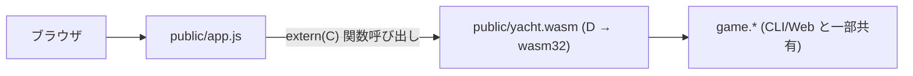

# WebAssembly 版 (作業中)

サーバ無しで GitHub Pages から遊べるようにするのが目標。
D で書いたゲームロジックを WASM にコンパイルし、ブラウザだけで動かす。

## 全体方針



- 既存の `web.api` (REST) と `web.session` は **使わない**。
- フロントは `fetch` でなく `WebAssembly.instantiateStreaming` で `.wasm` をロードし、
  `extern(C)` でエクスポートされた関数を直接呼ぶ。
- ゲーム状態は **WASM のリニアメモリ内** にグローバル変数で持つ。
  プレイヤー名は WASM では持たず、JS 側で配列管理する。

## ツールチェーン

- **コンパイラ**: [LDC](https://github.com/ldc-developers/ldc) (`ldc2`)。
  dmd は WebAssembly ターゲットを持たないので必須。Arch なら `sudo pacman -S ldc`。
- **ターゲット**: `wasm32-unknown-unknown-wasm`
- **モード**: `-betterC` (GC・例外・druntime を使わない)
  - 利用可能: `struct`、固定長配列 `int[N]`、`enum`、`extern(C)`、基本的なテンプレート、
    モジュールレベルの定数、`pure`/`@safe`
  - 不可: `class`、動的配列 `int[]` の `~=`、`string` への代入操作、連想配列、
    例外、GC アロケーション、TLS、unittest 実行 (コンパイルは可)
- **JS 連携**: `WebAssembly.Memory`、`WebAssembly.Module`、`instantiateStreaming`

## ビルド (LDC 導入後)

dub の追加 configuration `wasm` で:

```sh
dub build -c wasm --compiler=ldc2
# → public/yacht.wasm が出力される想定
```

直接 ldc2 を叩く案 (`scripts/build-wasm.sh`) は柔軟性が高いが、
まずは dub config で完結させる方向で試す。失敗したら shell script に切り替える。

## ディレクトリ計画

```text
Yacht/
├── source/
│   ├── wasm/
│   │   └── exports.d     # extern(C) で公開する関数群、PRNG、状態
│   ├── game/             # 一部を共有 (詳細下記)
│   ├── cli/              # 触らない (server ブランチでも動く)
│   ├── web/              # 触らない (server ブランチで動く)
│   └── ui/               # 触らない
├── public/
│   ├── index.html        # WASM 用 UI に書き換え予定
│   ├── app.js            # fetch → wasm exports に書き換え予定
│   ├── style.css         # ほぼ流用
│   └── yacht.wasm        # ← ビルド成果物 (gitignore)
└── docs/wasm.md          # このファイル
```

## ドメインの再利用

| モジュール          | WASM での扱い                                          |
| ------------------- | ------------------------------------------------------ |
| `game.category`     | `Category` enum と `score()` を再利用したい。          |
|                     | `categoryNames`/`categoryAliases`/`tryParseCategory` は |
|                     | string を扱うので WASM 側では使わない。                 |
| `game.dice`         | `Dice` 構造体 (`int[5]`) は再利用可能だが、            |
|                     | `std.random` 依存があるので `rollAll`/`rollOne` は     |
|                     | WASM では使わない。dice は exports.d 内で直接 `int[5]` を持つ。 |
| `game.score`        | `ScoreCard` (固定長配列) は再利用候補。                 |
| `game.state`        | **再利用しない**。`Player[]` 動的配列 / `string` /     |
|                     | `Random` を含むため。代わりに `WasmGame` を新設。        |
| `ui.*`、`web.*`     | WASM では完全に不使用。                                 |

`game.category` の `immutable string[] categoryNames = [...]` が betterC で問題に
なる可能性あり。だめなら category.d を「scoreロジック」と「文字列名」で分離する。

## 公開する API (案)

すべて `extern (C)` で関数のみ (戻り値は `int`、ポインタは使わない)。
複雑な構造はリニアメモリ越しでなく **getter で 1 値ずつ取り出す**。

```d
// 初期化
void yacht_new(int playerCount, uint seed);

// アクション (成功 1 / 失敗 0)
int yacht_roll_all();
int yacht_reroll(int positionMask);  // ビット 0..4 が ダイス 0..4 の振り直しフラグ
int yacht_record(int category);      // 成功時は確定した点数を返す。失敗時 -1
int yacht_preview(int category);     // 振っているダイスでの仮スコア。-1 = 不正

// 状態取得
int yacht_player_count();
int yacht_current_player();
int yacht_rolls_left();
int yacht_turn_started();   // 0 / 1
int yacht_is_over();        // 0 / 1
int yacht_die_value(int idx);                        // -1 で範囲外
int yacht_score_value(int player, int category);     // 0 含む整数 / 未確定でも 0
int yacht_score_used(int player, int category);      // 0 / 1
int yacht_player_total(int player);
```

PRNG は betterC 内で xorshift32 を実装。`std.random` には触らない。

## JS 側のラッパー (案)

```js
const wasmModule = await WebAssembly.instantiateStreaming(fetch("/yacht.wasm"), {});
const w = wasmModule.instance.exports;

const Yacht = {
  newGame(playerCount, names) {
    this.names = names;
    w.yacht_new(playerCount, (Math.random() * 2**32) >>> 0);
  },
  rollAll()         { return !!w.yacht_roll_all(); },
  reroll(positions) {
    const mask = positions.reduce((m, p) => m | (1 << p), 0);
    return !!w.yacht_reroll(mask);
  },
  record(catIdx)    { return w.yacht_record(catIdx); },
  preview(catIdx)   { return w.yacht_preview(catIdx); },
  state() {
    const playerCount = w.yacht_player_count();
    const players = [];
    for (let p = 0; p < playerCount; p++) {
      const scores = {};
      let total = 0;
      for (let c = 0; c < CATEGORY_KEYS.length; c++) {
        if (w.yacht_score_used(p, c)) {
          const v = w.yacht_score_value(p, c);
          scores[CATEGORY_KEYS[c]] = v;
          total += v;
        } else {
          scores[CATEGORY_KEYS[c]] = null;
        }
      }
      players.push({ name: this.names[p], scores, total });
    }
    const dice = Array.from({length: 5}, (_, i) => w.yacht_die_value(i));
    return {
      currentPlayer: w.yacht_current_player(),
      rollsLeft: w.yacht_rolls_left(),
      turnStarted: !!w.yacht_turn_started(),
      isOver: !!w.yacht_is_over(),
      dice,
      players,
      preview: this._buildPreview(playerCount),
      // winner は isOver なら JS 側で集計
    };
  },
  // ...
};
```

`Yacht.state()` が今までの REST レスポンスと同じ形を返せれば、
`public/app.js` の `render*` 系はほぼそのまま使える。

## ステップ計画

1. **LDC 導入** (← いまここ)
2. `dub.json` に `wasm` configuration を追加し、`source/wasm/exports.d` で
   "Hello from WASM" 相当の関数 1 つだけがビルドできることを確認。
3. `exports.d` に PRNG とゲームロジックを実装し、unit テストはせず JS 側から呼ぶ。
4. `public/app.js` に WASM ローダを追加し、REST 呼び出しを置き換える。
   `index.html` / `style.css` は最小限の修正で済ます (UI 概念は同じ)。
5. `public/yacht.wasm` を含めた状態で GitHub Pages から配信できるようにする
   (Pages の設定は `main` ブランチの `/` か `/docs` を root に。後で決める)。

## 既知のリスク

- `game.category` の `immutable string[]` が betterC で initial run-time work を要求する場合、
  **モジュールを分割** する。`game.category.score` が pure かつ string を返さないので
  関数だけは流用しやすいはず。
- WASM では Random を毎回 JS から渡す方式 (`yacht_set_seed(uint)`) も検討する。
- LDC のバージョン差で wasm リンク用フラグが変わる可能性あり (`-link-internally`,
  `-L=--no-entry`, `-L=--export-all` など)。実機で試して docs を更新する。
