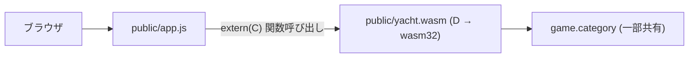

# WebAssembly 版

サーバ無しで GitHub Pages から遊べる構成。
D で書いたゲームロジックを WASM にコンパイルし、ブラウザだけで動かす。

詳しい役割は `docs/architecture.md` を、CPU AI は `docs/cpu.md`、
言語切替の仕組みは `docs/i18n.md`、デプロイは `docs/deploy.md` を参照。

## ビルド

```sh
scripts/build-wasm.sh         # → public/yacht.wasm (約 8 KB)
```

スクリプトの中身は LDC を直接呼ぶだけ:

```sh
ldc2 -mtriple=wasm32-unknown-unknown-wasm \
  -betterC -Os -release --boundscheck=off \
  source/wasm/exports.d source/game/category.d \
  -L=--no-entry -L=--export-dynamic \
  -of=public/yacht.wasm
```

LDC + wasm-ld (lld の一部) が必要。Arch なら `sudo pacman -S ldc lld`。

## ローカルで遊ぶ

```sh
scripts/serve.sh              # → http://127.0.0.1:8765/
```

詳しい手順は `docs/README.md` の「ローカル動作確認」を参照。

## 全体方針



- フロントは `fetch` でなく `WebAssembly.instantiate(arrayBuffer)` で
  `.wasm` をロードし、`extern(C)` でエクスポートされた関数を直接呼ぶ。
- ゲーム状態は **WASM のリニアメモリ内** にグローバル変数 (`__gshared WasmGame g`) で持つ。
  プレイヤー名は WASM では持たず、JS 側 (`state.names`) で配列管理する。

## ツールチェーン

- **コンパイラ**: [LDC](https://github.com/ldc-developers/ldc) (`ldc2`)。
  dmd は WebAssembly ターゲットを持たないので必須。
- **ターゲット**: `wasm32-unknown-unknown-wasm`
- **モード**: `-betterC` (GC・例外・druntime を使わない)
  - 利用可能: `struct`、固定長配列 `int[N]`、`enum`、`extern(C)`、基本的なテンプレート、
    モジュールレベルの定数、`pure` / `@safe`
  - 不可: `class`、動的配列 `int[]` の `~=`、`string` への代入操作、連想配列、
    例外、GC アロケーション、TLS、unittest 実行 (コンパイルは可)
- **JS 連携**: `WebAssembly.Memory`、`WebAssembly.Module`、`instantiate`

## ドメインの再利用方針

| モジュール          | WASM での扱い                                          |
| ------------------- | ------------------------------------------------------ |
| `game.category`     | `Category` enum と `score()` を再利用。                 |
|                     | 文字列 (`categoryNames` / `tryParseCategory`) は       |
|                     | `version (D_BetterC) {} else { ... }` で WASM 時除外。  |
| `game.dice`         | 再利用しない。`Dice` 構造体は `int[5]` だけだが        |
|                     | `std.random` 依存があるため。`int[5] dice` を直接持つ。 |
| `game.score`        | 再利用しない。`Scorecard` を WASM 用に新設 (固定長)。   |
| `game.state`        | 再利用しない。`Player[]` 動的配列 / `string` /         |
|                     | `Random` を含むため。代わりに `WasmGame` を新設。       |
| `ui.*`              | WASM では完全に不使用 (CLI 専用)。                      |

## 公開する API

すべて `extern (C)` の関数。戻り値は `int`、複雑な構造はリニアメモリ越しでなく
**getter で 1 値ずつ取り出す**。

```d
// 初期化
void yacht_new(int playerCount, uint seed);

// アクション (成功 1 / 失敗 0、record/preview だけ点数 / -1)
int yacht_roll_all();
int yacht_reroll(int positionMask);  // ビット 0..4 が ダイス 0..4 の振り直しフラグ
int yacht_record(int category);      // 確定した点数 / -1
int yacht_preview(int category);     // 振っているダイスでの仮スコア / -1

// 状態取得
int yacht_player_count();
int yacht_current_player();
int yacht_rolls_left();
int yacht_turn_started();   // 0 / 1
int yacht_is_over();        // 0 / 1
int yacht_die_value(int idx);                        // -1 で範囲外
int yacht_score_value(int player, int category);     // 0 含む整数 / 未確定でも 0
int yacht_score_used(int player, int category);      // 0 / 1
int yacht_player_total(int player);
```

PRNG は `xorshift32` を内部実装。`std.random` には触らない。
`yacht_new` でシード 0 が渡された場合は内部で `1` に置き換える (退化防止)。

JS 側のラッパーは `public/app.js` の `snapshotFromWasm()` を参照。
REST 版 (server ブランチ) と同じ形の state を組み立てているので、
`render*()` 系は CLI / WASM 両方で共通の思想。

## 既知の制約 / 注意

- ゲーム状態は WASM のリニアメモリ内 (`__gshared WasmGame g`) に持つ。
  ページリロードで失われる (= 中断したゲームは復帰できない)。
  必要になったら JS 側で snapshot を `localStorage` に保存して再現する仕掛けを足す。
- ビルドは **`-release --boundscheck=off`** が必須。
  デバッグビルドだと配列添字チェックの `__assert` が引き、リンクできない。
- `game.category` から **string を扱う関数を WASM ビルドに含めると `memcmp` 未解決** で死ぬ。
  分離は `version (D_BetterC)` だけで十分。
- `--export-dynamic` で全 D 関数を export しているが、
  wasm のサイズは ~8KB なので問題視していない。気になるなら個別 `--export=yacht_*` に切り替える。
