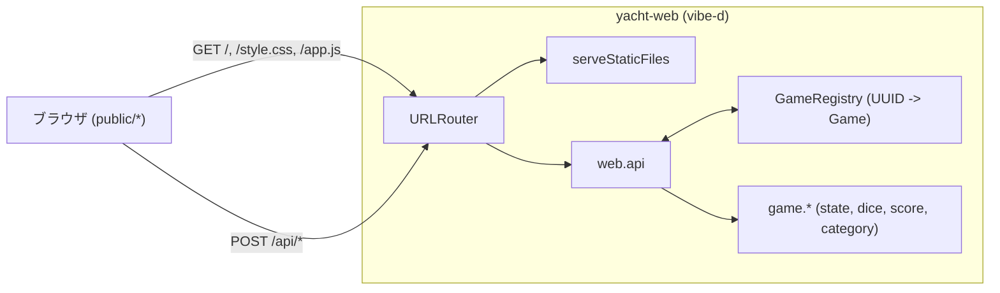

# Web アプリ版 (yacht-web)

ブラウザから遊べるバージョン。CLI 版と **同じドメインロジック** (`game.*`)
を再利用し、上に HTTP サーバーと SPA フロントエンドを乗せている。

## 起動と利用

```sh
dub run -c web
# ↓ ログ
# Yacht web server: http://127.0.0.1:8080/
```

ブラウザで <http://127.0.0.1:8080/> を開く。

CLI 版は今までどおり:

```sh
dub run -c cli     # CLI (default config なら -c は省略可)
dub test           # unittest (cli config がデフォルトテスト対象)
```

## 技術スタック

| レイヤー       | 採用                                         | 理由                                                    |
| -------------- | -------------------------------------------- | ------------------------------------------------------- |
| 言語 (バック)  | D / dmd                                      | プロジェクト全体の言語                                  |
| ビルド         | dub (`configurations` で CLI / Web を切替)   | 1 リポジトリで 2 バイナリ                               |
| HTTP サーバー  | [vibe-d:http](https://vibed.org) `~>0.10`    | D 標準のデファクト。fiber ベースで非同期 I/O が素直     |
| 非同期ランタイム | vibe-core (vibe-d 内蔵)                    | epoll バックエンド (eventcore) で動作                   |
| ルーティング   | `vibe.http.router.URLRouter`                 | パスごとにハンドラを登録できる、シンプルな router       |
| 静的ファイル   | `vibe.http.fileserver.serveStaticFiles`      | `public/` を直接公開                                    |
| JSON           | `vibe.data.json.Json`                        | リクエスト/レスポンスのボディを動的に組み立て・パース   |
| セッション保持 | プロセス内 `Game[string]` (UUID キー)        | 永続化なし。ブラウザ側 `localStorage` に gameId を保存  |
| フロントエンド | 素の HTML / CSS / vanilla JS (`fetch` API)   | フレームワーク無しで読みやすさ優先                      |

依存パッケージのバージョン (実際にロックされたもの) は `dub.selections.json` に記録される。

## ディレクトリ構成 (Web 関連)

```text
Yacht/
├── source/
│   ├── cli/app.d           # CLI 版エントリ (こちらは元の app.d)
│   ├── web/
│   │   ├── app.d           # Web 版エントリ (vibe-d を起動)
│   │   ├── api.d           # REST ハンドラ + Game ↔ JSON
│   │   └── session.d       # GameRegistry (UUID で Game を保持)
│   ├── game/               # ドメイン (CLI/Web 共通)
│   └── ui/                 # CLI 描画/パース (Web では未使用)
├── public/                 # 静的アセット
│   ├── index.html
│   ├── style.css
│   └── app.js
└── docs/web.md             # このファイル
```

## アーキテクチャ



要点:

- **ドメインを再利用**: `web.api` が `Game.create / rollAll / reroll / record` を呼ぶだけ。
  ルール・点数計算は CLI と同じコード (`game.category.score`)。
- **状態はサーバー側**: 各ゲームを UUID で `GameRegistry` に保持。
  ブラウザは gameId を `localStorage` に保存し、リロードしても続けられる
  (プロセス再起動で消えるのは仕様)。
- **vibe-d は既定でシングルスレッド** (1 イベントループ + 多数の fiber)。
  それでも将来のスレッド化に備えて `GameRegistry` は `core.sync.mutex.Mutex` で保護している。

## REST API

すべて JSON 入出力。エラー時は `{"error": "...", "state": ...}` のように
`error` フィールドが追加される (HTTP ステータスは 200/400/404)。
ステート構造はどの呼び出しでも共通。

| メソッド | パス             | 用途                                 |
| -------- | ---------------- | ------------------------------------ |
| POST     | `/api/new`       | 新規ゲーム作成                        |
| POST     | `/api/roll`      | 手番の最初の振り (5 個)               |
| POST     | `/api/reroll`    | 指定位置のダイスのみ振り直し          |
| POST     | `/api/score`     | 役を確定して次のプレイヤーへ          |
| GET      | `/api/state`     | 現在の状態取得 (リロード時など)       |

### POST /api/new

リクエスト:

```json
{ "playerCount": 2, "names": ["Alice", "Bob"] }
```

`names` は省略可 (省略時 / 不足分は `P1`, `P2`, ... が補われる)。

レスポンス:

```json
{ "gameId": "<uuid>", "state": <State> }
```

### POST /api/roll

```json
{ "gameId": "<uuid>" }
```

→ `{"state": <State>}`。手番の最初の振りでないと `error: "cannot roll ..."` を返す。

### POST /api/reroll

```json
{ "gameId": "<uuid>", "positions": [0, 2, 4] }
```

`positions` は **0-indexed**。`turnStarted == false` のとき、
あるいは `rollsLeft <= 0` のときは `error` を返す。

### POST /api/score

```json
{ "gameId": "<uuid>", "category": "yacht" }
```

`category` は `categoryNames` のいずれか (例: `"ones"`, `"full-house"`, `"yacht"`)。
受理されると `Game.record` が呼ばれ、現在のダイスが該当カテゴリに記録され、
手番が次プレイヤーに進む。

### GET /api/state?gameId=<uuid>

現在の `<State>` を返すだけ。フロントの「セッション復帰」用。

### `<State>` の中身

```json
{
  "currentPlayer": 0,
  "rollsLeft": 2,
  "turnStarted": true,
  "isOver": false,
  "dice": [3, 5, 5, 1, 2],
  "players": [
    {
      "name": "Alice",
      "scores": { "ones": null, "twos": 4, "..." : "..." },
      "total": 4
    }
  ],
  "preview": { "ones": 0, "twos": 4, "...": "..." },
  "winner": "Alice",
  "winnerScore": 87
}
```

- `preview` は **未使用カテゴリのみ**、現在のダイスで仮確定したときの点数。
  手番が始まっていない (`turnStarted == false`) ときは含まれない。
- `winner` / `winnerScore` は `isOver == true` のときだけ含まれる。
- `scores[c]` は **未確定なら `null`**、確定済みなら整数 (0 を含む)。

## フロントエンド

フレームワークなし。`public/app.js` 内で:

- `fetch` で各 API を叩く (`api(method, path, body)` ヘルパ)
- レスポンスの `state` を `state.snapshot` に置いて、`render()` で全描画
- ダイスはクリックで `selected` クラスをトグル → 振り直しボタンで送信
- `localStorage["yacht.gameId"]` で gameId を保存し、リロード時に `/api/state` で復帰
- `localStorage["yacht.lang"]` で UI 言語 (`ja` / `en`) を保存
- カテゴリ確定はクリック後 `confirm()` で誤爆防止

UI は概念上 1 ページ:

1. `#setup` セクション (人数 + 名前入力 → Start)
2. `#game` セクション (status / dice / category buttons / scoreboard)
3. ゲーム終了で `#game-over` パネル表示

### 振るボタンの自動切替

Yacht のルール上「全 5 個を振り直す」のは手番の最初の投だけで、以降の投は
必ず一部のダイスをキープする。そのため UI 上のボタンは 1 個だけにしてある:

- `state.turnStarted == false` (この手番でまだ振っていない) → ラベル「振る」、`POST /api/roll`
- `state.turnStarted == true`                              → ラベル「選んだダイスを振り直す」、`POST /api/reroll`

切替は `renderRollButton(s)` 内で `s.turnStarted` を見るだけ。
振り直しモードで何も選択していなければ `flash()` でメッセージを出し、
リクエストは送らない。

### 役名のツールチップ・遊び方モーダル

役名がパッと見ピンと来ないので、補助 UI を 2 つ用意した:

- **ツールチップ**: 役名にマウスを乗せると、その役の意味が小さく出る。
  CSS のみで実装。`.tip-host` を付けたホスト要素の中に `<span class="tip">` を入れ、
  `.tip-host:hover .tip` で表示する。動作元は (a) カテゴリボタン (`#categories` 内)
  と (b) スコアボード左列の役名セルの両方。文言は `I18N[lang].categoryTips[c]` から取る。
- **遊び方モーダル**: 右上「遊び方」ボタンで開く。`#help-modal` (背景クリック / Escape で閉じる) に
  `renderHelpModal()` が現在言語の `I18N[lang].help` (進め方リスト + 役一覧) を流し込む。
  言語切替時は `applyStaticI18n()` がモーダル展開中なら `renderHelpModal()` を再実行する。

新しい役を追加したら **3 箇所** にエントリを追加する必要がある:
`categories` (表示名) / `categoryTips` (ホバー説明) / `help.roles` (モーダル一覧)。

### 国際化 (i18n)

軽量な辞書ベースの仕組み。フレームワーク不要。

- `I18N = { ja: {...}, en: {...} }` をモジュール先頭に置く。値は文字列または `(args) => string` の関数。
- 取得は `t(key, ...args)` と `tCat(categoryKey)`。
- 静的な要素は HTML に `data-i18n="key"` を付けておき、`applyStaticI18n()` が
  `querySelectorAll("[data-i18n]")` で textContent を一括置換。
- 動的に生成する要素 (ステータス・スコアボード・カテゴリボタン) は、
  各 `render*` 関数内で `t()` / `tCat()` を呼びながら組み立てる。
- 言語切替ボタン (`#btn-lang`) は `state.lang` をトグルして
  `applyStaticI18n()` + 既存の `render()` を再実行するだけ。
- **デフォルトは日本語** (`localStorage.getItem("yacht.lang") || "ja"`)。

新しい文言を追加するときは `I18N.ja` と `I18N.en` の **両方** に同じキーを足す。
片側だけだと `t()` が `undefined` を返して画面に表示されるので、不一致は気づきやすい。

## 設計上の選び方 (なぜそうしたか)

- **CLI と Web を 1 リポジトリ・2 configuration**: ドメインを共有しつつ、
  CLI 用ビルドは vibe-d を引き込まないので速い (`excludedSourceFiles` で web 配下を除外)。
- **REST + ポーリングなし**: Yacht はターン制で、状態が変わるのは
  「自分のクリック直後」のみ。WebSocket / SSE は不要。
- **Game ID をクライアントが握る**: サーバー側 Cookie / セッション機構を作らず、
  `localStorage` に置く。シンプルで、複数タブ・複数ゲームも追加実装しやすい。
- **vibe-d:http だけ依存**: `vibe-d` 全部入りより依存が少なく、ビルド時間も短い。
- **JSON は手で組み立てる**: `vibe.data.json.serializeToJson` で Game をそのまま吐くと、
  内部表現 (`used` 配列など) がフロントに漏れる。`serializeGame` で API 形に整形している。

## 拡張するときの目安

1. **複数プレイヤーが別々のブラウザから参加する** → gameId をシェアする URL (`?game=<id>`) を作る。
2. **更新の即時反映** → vibe-d の WebSocket (`vibe.http.websockets`) に切り替え、
   状態変化のたびにブロードキャスト。
3. **永続化** → `GameRegistry` をファイル/SQLite に保存。
4. **TLS** → `HTTPServerSettings.tlsContext` を設定 (`vibe-d:tls` を有効化)。
